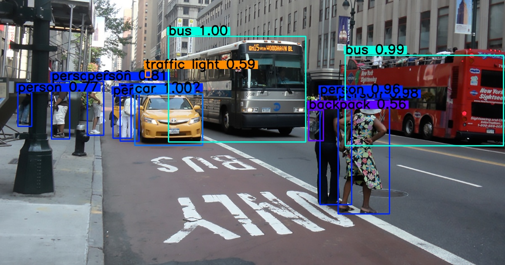

# YOLOv3: Inplement in Tensorflow 2.0



## Download Dataset

1. Please download the [VOC2012](http://host.robots.ox.ac.uk/pascal/VOC/) dataset and put it into `data` folder.

```
$ mkdir data
$ wget http://host.robots.ox.ac.uk/pascal/VOC/voc2012/VOCtrainval_11-May-2012.tar -O ./data/VOCtrainval_11-May-2012.tar
$ tar xvf ./data/VOCtrainval_11-May-2012.tar --directory ./data
```

2. Split dataset and transfer to `tfrecord`.

```bash
# train
$ python3 voc2012.py \
    --data_dir ./data/VOCdevkit/VOC2012/ \
    --split train \
    --output_file ./data/voc2012_train.tfrecord

# val
$ python3 voc2012.py \
    --data_dir ./data/VOCdevkit/VOC2012/ \
    --split val \
    --output_file ./data/voc2012_val.tfrecord
```

## Download pre-trained Darknet weights

```bash
$ wget https://pjreddie.com/media/files/yolov3.weights -O model_data/yolov3.weights
```

## Step-by-Step

```yolov3_step_by_step.ipynb```

1. Jupyter Notebook

    ```bash
    $ jupyter notebook
    ```

2. Colab

    [](https://colab.research.google.com/github/kaka-lin/yolov3-tf2/blob/master/yolov3_step_by_step.ipynb)

## Acknowledgments

- [YAD2K](https://github.com/allanzelener/YAD2K)
- [keras-yolo2](https://github.com/experiencor/keras-yolo2)
- [yolov3-tf2](https://github.com/zzh8829/yolov3-tf2)
