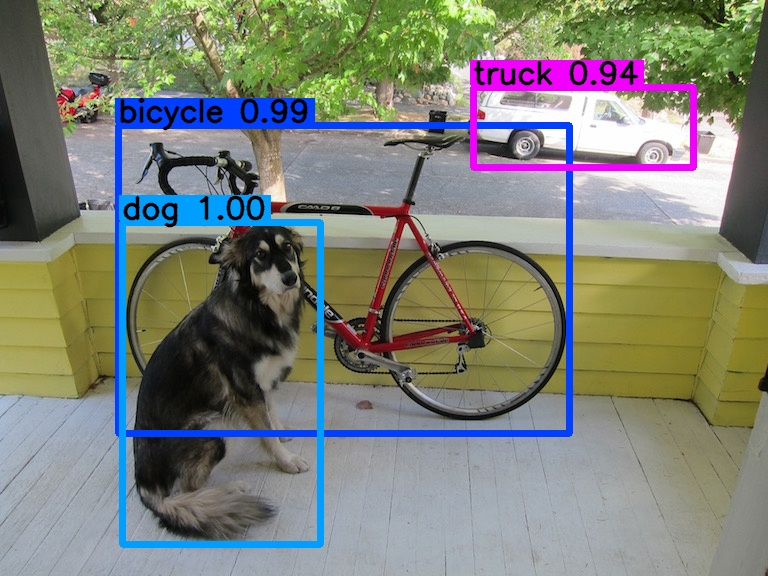

# YOLOv3: Inplement in Tensorflow 2

This repo is the implementation of YOLOv3 with Tensorflow 2. It refers to many repos as mentioned in [Acknowledgments](#acknowledgments).

Original paper: [YOLOv3: An Incremental Improvemen](https://pjreddie.com/media/files/papers/YOLOv3.pdf) by Joseph Redmon and Ali Farhadi.

Darknet: https://github.com/pjreddie/darknet



## Step-by-Step

```yolov3_step_by_step.ipynb```

1. Jupyter Notebook

    ```bash
    $ jupyter notebook
    ```

2. Colab

    [](https://colab.research.google.com/github/kaka-lin/yolov3-tf2/blob/master/yolov3_step_by_step.ipynb)

## Prepare the Dataset

1. Please download the [VOC2012](http://host.robots.ox.ac.uk/pascal/VOC/) dataset and put it into `data` folder.

    ```
    $ mkdir data
    $ wget http://host.robots.ox.ac.uk/pascal/VOC/voc2012/VOCtrainval_11-May-2012.tar -O ./data/VOCtrainval_11-May-2012.tar
    $ tar xvf ./data/VOCtrainval_11-May-2012.tar --directory ./data
    ```

2. Split dataset and transfer to `tfrecord`.

    ```bash
    # train
    $ python3 voc2012.py \
        --data_dir ./data/VOCdevkit/VOC2012/ \
        --split train \
        --output_dir ./data

    # val
    $ python3 voc2012.py \
        --data_dir ./data/VOCdevkit/VOC2012/ \
        --split val \
        --output_dir ./data
    ```

3. Validate the dataset

    ```bash
    $ python3 visualize.py
    ```

## Training

### Training from scratch

```bash
$ python3 train.py --transfer=Fasle
```

### Transfer Learning

1. Download pre-trained Darknet weights

    ```bash
    $ wget https://pjreddie.com/media/files/yolov3.weights -O model_data/yolov3.weights
    ```

2. Convert Darknet weights to Tensorflow weights

    ```bash
    $ mkdir -p checkpoints
    $ python3 convert.py
    ```

3. Validate pre-trained weight

    ```bash
    $ python3 detect.py
    ```

4. Training

    ```bash
    $ python3 train.py \
        --train_dataset ./data/voc2012_train.tfrecord \
        --val_dataset ./data/voc_2012_val.tfrecord ]
        --num_classes 20 \
        --batch_size 16 \
        --epochs 10 \
        --pretrained_weights ./checkpoints/yolov3.tf \
        --weights_num_classes 80
    ```

## Inference

```bash
$ python3 detect.py \
    --classes ./model_data/voc2012_classes.txt \
    --num_classes 20 \
    --weights=./checkpoints/yolov3_train_5.tf \
    --image=./data/street.jpg
```

## Acknowledgments

- [YAD2K](https://github.com/allanzelener/YAD2K)
- [keras-yolo2](https://github.com/experiencor/keras-yolo2)
- [yolov3-tf2](https://github.com/zzh8829/yolov3-tf2)
