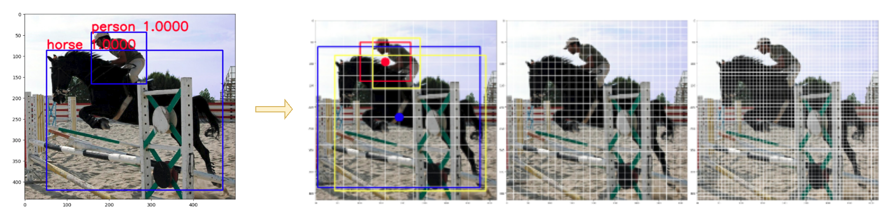
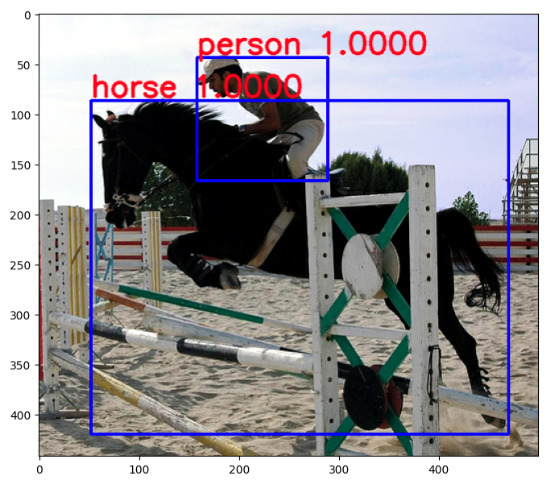
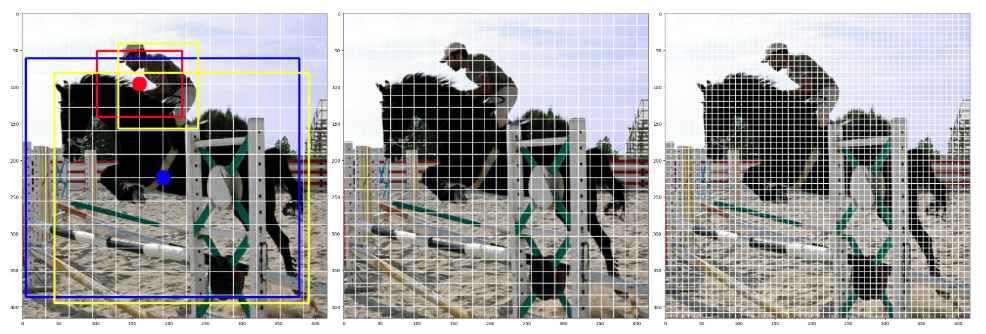
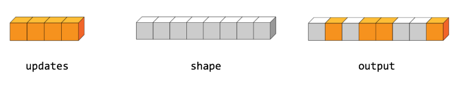

# Change true boxes to training labels

我們需要將 `true_boxes` 轉換 `y_train` 的格式，以進行 model training。如下:



- True boxes: `[xmin, ymi, xmax, ymax, classes]`
- Training labele: `[grid, grid, anchor_nums, [x, y, w, h, obj, classes]]`

Example:

- True boxes (`ture_boxes`):

    

    ```python
    [[0.106 0.196832582  0.942 0.950226247 12.]  # horse
     [0.316 0.0995475128 0.578 0.377828062 14.]] # person
    ```

- Training labels (`y_trues`):

    因為物件皆為大物件，所以 boxes 皆集中在第一個尺度 anchor size (13x13) 裡，且中心分別在 (4,6) 的 person 和 (8,7) 的 horse，如下:

    

    > 黃色框框為 true_boxes

    ```python
    [[[[0. 0. 0. 0. 0. 0.]
       [0. 0. 0. 0. 0. 0.]
       [0. 0. 0. 0. 0. 0.]]
             ...
      [[0. 0. 0. 0. 0. 0.]
       [0. 0. 0. 0. 0. 0.]
       [0. 0. 0. 0. 0. 0.]]] # 1~3 (13, 3, 6)


     [[[0. 0. 0. 0. 0. 0.]
       [0. 0. 0. 0. 0. 0.]
       [0. 0. 0. 0. 0. 0.]]
             ...
      [[0.316  0.09954751  0.578  0.37782806  1.  14.]
       [0.     0.          0.     0.          0.  0. ]
       [0.     0.          0.     0.          0.  0. ]] # index: [4, 6]
             ...
      [[0. 0. 0. 0. 0. 0.]
       [0. 0. 0. 0. 0. 0.]
       [0. 0. 0. 0. 0. 0.]]] # 4 (13, 3, 6)


     [[[0. 0. 0. 0. 0. 0.]
       [0. 0. 0. 0. 0. 0.]
       [0. 0. 0. 0. 0. 0.]]
             ...
      [[0. 0. 0. 0. 0. 0.]
       [0. 0. 0. 0. 0. 0.]
       [0. 0. 0. 0. 0. 0.]]] -# 5~7 (13, 3, 6)


     [[[0. 0. 0. 0. 0. 0.]
       [0. 0. 0. 0. 0. 0.]
       [0. 0. 0. 0. 0. 0.]]
             ...
      [[0.     0.          0.     0.          0.  0.]
       [0.     0.          0.     0.          0.  0.]
       [0.106  0.19683258  0.942  0.95022625  1.  12.]] # index: [8, 7]
             ...
      [[0. 0. 0. 0. 0. 0.]
       [0. 0. 0. 0. 0. 0.]
       [0. 0. 0. 0. 0. 0.]]] # 8 (13, 3, 6)


     [[[0. 0. 0. 0. 0. 0.]
       [0. 0. 0. 0. 0. 0.]
       [0. 0. 0. 0. 0. 0.]]
             ...
      [[0. 0. 0. 0. 0. 0.]
       [0. 0. 0. 0. 0. 0.]
       [0. 0. 0. 0. 0. 0.]]]] # 9~13 (13, 3, 6)
    ```
## Implementation

完整版請看 [here](https://github.com/kaka-lin/yolov3-tf2/blob/master/test_preprocess_true_boxes.py)，以下說明各步驟。


### Step 0. Boxes Padding

此步驟為統一每張圖片 boxes 數量，以利後續進行相關矩陣運算。

> Tensor 矩陣運算，維度皆需一樣

這邊使用 [tf.pad]([tf.pad](https://www.tensorflow.org/api_docs/python/tf/pad))，如下:

```python
true_boxes = tf.constant(
    [[0.106, 0.196832582, 0.942, 0.950226247, 12.],
     [0.316, 0.0995475128, 0.578, 0.377828062, 14.]])

"""Add zero pad for training

讓每張 image 的 object 數量都一樣。
Ex: 這裡設置100，表示每張圖片最多允許存在100個框

paddings = [[row_top, row_bottom], [col_left, col_right]]
"""
num_max_box = 100
paddings = [[0, num_max_box - tf.shape(y_train)[0]], [0, 0]]
y_train = tf.pad(true_boxes, paddings) #(N, 5)
```

### Step 1. Find the best anchor

計算各 true boxes 與各 anchors 之間的 `IOU`值，找到最接近的那個 anchor，如下:

> ###### 注意:
>
> 這邊的 anchors 與 true_boxes (y_train) 皆為 normalization to 0~1，
> 這樣默認兩者的中心點皆為 (0,0)， 可以方便計算 `IOU`

YOLOv3 anchors 如下:

```python
anchors = np.array([
    (10, 13), (16, 30), (33, 23),
    (30, 61), (62, 45), (59, 119),
    (116, 90), (156, 198), (373, 326)], np.float32) / 416

# 用來 get 相對應的 anchor
anchor_masks = np.array([[6, 7, 8],  # 13x13
                         [3, 4, 5],  # 26x26
                         [0, 1, 2]]) # 52x52
```

Calculate IOU, and find the best anchor

```python
# anchor area
anchors = tf.cast(anchors, tf.float32)
anchor_area = anchors[..., 0] * anchors[..., 1] # (9,)

# true boxe area
# y_train shape: (N, (x1, y1, x2, y2, classes))
boxes_wh = y_train[..., 2:4] - y_train[..., 0:2] # (N, 2)

# expand dimension for compare with anchor
boxes_wh = tf.tile(tf.expand_dims(boxes_wh, -2),
                  (1, tf.shape(anchors)[0], 1)) # (N, 9, 2)
boxes_area = boxes_wh[..., 0] * boxes_wh[..., 1] # (N, 9)

# Find best anchors
intersection = tf.minimum(boxes_wh[..., 0], anchors[..., 0]) * \
    tf.minimum(boxes_wh[..., 1], anchors[..., 1]) # (N, 9)
iou = intersection / (boxes_area + anchor_area - intersection) # (N, 9)

best_anchor_idx = tf.cast(tf.argmax(iou, axis=-1), tf.float32) # (N,)
best_anchor_idx = tf.expand_dims(best_anchor_idx, -1) # (N, 1)
best_anchor_idx = tf.cast(best_anchor_idx, tf.int32)
```

### Step 2. Find which grid includes the center of object

最終，我們用上面找出的 `best_anchor_idx` 來找出物件是屬於哪一個 anchor size 裡，及哪一個 grid 中含有物件。可以分為以下兩個部份:

1. 找到物件屬於哪一個 anchor size (feature map): 13x13, 26x26, or 52x52
2. 找到物件中心位於哪一個 grid

#### Step 2-1. Find the feature map that object  belongs

因為算出來的 bset_anchor_idx 為 0~8 中的某一個數字，對應為某一個 anchor。例如: `best_anchor_idx = 6`，可得 anchor 為 `(116, 90)` 這組。

所以我們首先遍立 `anchor_masks` 來區分現在是哪一個 anchor size，如下:

```python
y_outs = []
grid_size = image_size // 32

for anchor_idxs in anchor_masks:
    y_outs.append(transform_bboxes_for_output(
            y_train, grid_size, anchor_idxs, best_anchor_idx))
    grid_size *= 2
```

```python
def transform_bboxes_for_output(y_true,
                                grid_size,
                                anchor_idxs,
                                best_anchor_idx):
    # y_true: (max_boxes, [x1, y1, x2, y2, classes])
    N = tf.shape(y_true)[0] # 就是我們第0步時設置的最大物件數

    # y_true_out: (grid, grid, anchors, [x, y, w, h, obj, classes])
    # tf.shape(anchor_idxs)[0]: 3
    y_true_out = tf.zeros(
        (grid_size, grid_size, tf.shape(anchor_idxs)[0], 6))

    indices = tf.TensorArray(tf.int32, 1, dynamic_size=True)
    updates = tf.TensorArray(tf.float32, 1, dynamic_size=True)

    anchor_idxs = tf.cast(anchor_idxs, tf.int32)
    for i in range(N):
        # 忽略那些為0的物件
        if tf.equal(y_true[i][0], 0):
            continue

        # 找到是屬於哪一個 anchor
        anchor_eq = tf.equal(
            anchor_idxs, best_anchor_idx[i][0])
        anchor_idx = tf.cast(tf.where(anchor_eq), tf.int32)
        ...
```

#### Step 2-2.  Find which grid includes the center of object

步驟 2-1 已經找到此物件屬於哪一個 anchor size，再來就是計算它的中心位於哪一個 grid。如下:

> 因為 boxes normalization to 0~1，所以這邊要乘相對應的 gird_size (13, 26, or 52)，以轉換回各 feature map 中的位置與尺寸

```python
if tf.reduce_any(anchor_eq):
    # Find which grid includes the center of object
    boxes_xy = (y_true[i][0:2] + y_true[i][2:4]) / 2
    grid_xy = tf.cast(boxes_xy * grid_size, tf.int32)
```

最後我們這邊使用 [tf.tensor_scatter_nd_update](https://www.tensorflow.org/api_docs/python/tf/tensor_scatter_nd_update) (使用方式 [here](#example-of-tftensor_scatter_nd_update)) 來將算出來的 index (如: 哪一個 anchor 裡的哪一個 grid) 更新至 `y_true_out` 裡相對應的位置。如下:

```python
indices = indices.write(i, [grid_xy[1], grid_xy[0], anchor_idx[0][0]])
updates = updates.write(i, [y_true[i][0], y_true[i][1], y_true[i][2], y_true[i][3], 1, y_true[i][4]])

y_out = tf.tensor_scatter_nd_update(
    y_true_out, indices.stack(), updates.stack())
```

結果如下所示:


---

## Example of `tf.tensor_scatter_nd_update()`

首先先來看看 tf.tensor_scatter_nd_update() 如何使用，如下:



```python
tensor = [0, 0, 0, 0, 0, 0, 0, 0]    # tf.rank(tensor) == 1
indices = [[1], [3], [4], [7]]       # num_updates == 4, index_depth == 1
updates = [9, 10, 11, 12]            # num_updates == 4
print(tf.tensor_scatter_nd_update(tensor, indices, updates))
```

Output:

```
tf.Tensor([ 0  9  0 10 11  0  0 12], shape=(8,), dtype=int32)
```
