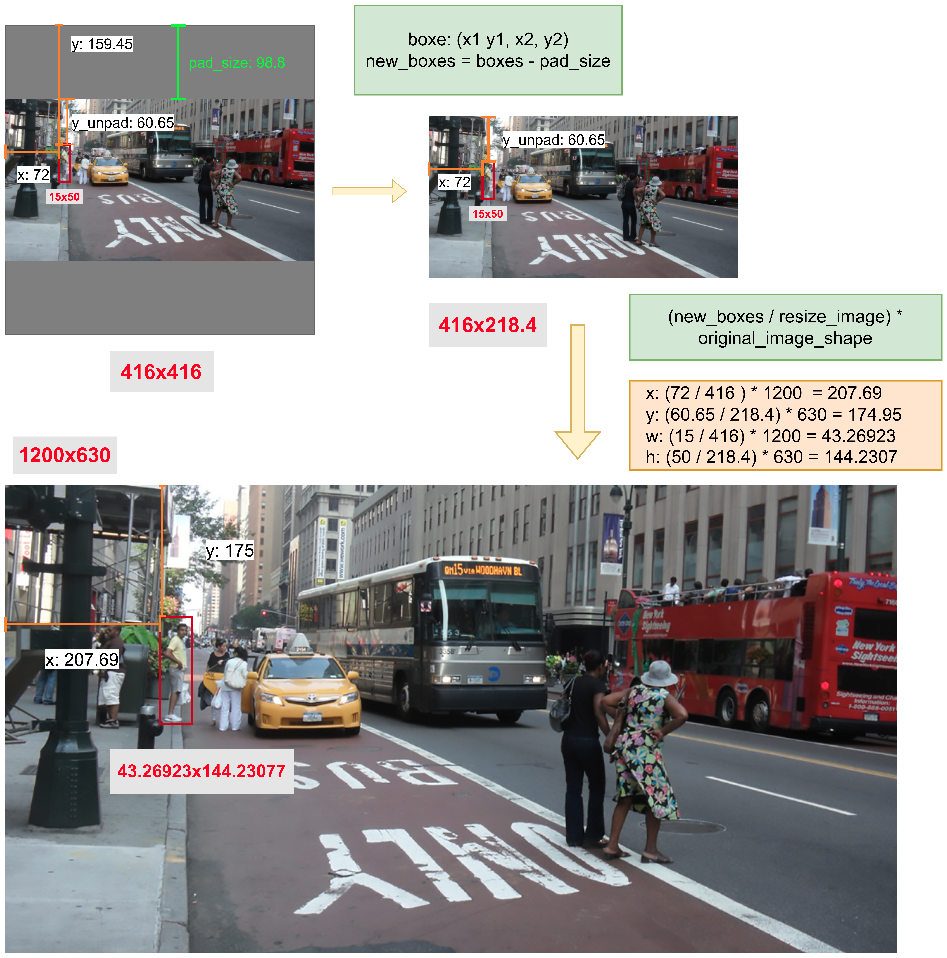

#  Rescales bounding boxes to the original image shape

將 model 輸出的 boxes 轉換回原始圖像的位置與尺寸。

說明如下:

```
Original image size: (1200, 630) [image_shape]
model input size: (416, 416) []

1. letterbox:
    scale = min((416, 416) / (1200, 630)) (w, h)
    resized_shape: (416.0, 218.4), unpad_size
    pad_size:     (0,     197.6)

2. Get the boxes position on resized_image
    new_boxes = (boxes - pad_size // 2)

3. Rescale bounding boxes to dimension of original image
    new_boxes = (new_boxes / resized_shape) * image_shape
```



程式如下:

```python
def rescale_boxes(boxes, inpute_shape, image_shape):
    """ Rescales bounding boxes to the original image shape.

    This is for letterbox().

    Args:
        inpu_shape: model input shape. (h, w)
        image_shape: the shape of origin image. (h, w)
    """
    height, width = image_shape[0], image_shape[1]
    image_shape = np.array((width, height))

    # 1. Calculate padding_size
    scale = min(inpute_shape / image_shape)
    resized_shape = image_shape * scale # unpad_size
    pad_size = inpute_shape - resized_shape

    # For tf 2.x
    pad_size = tf.stack([pad_size[0], pad_size[1], pad_size[0], pad_size[1]])
    pad_size = tf.cast(tf.reshape(pad_size, [1, 4]), tf.float32)
    resized_shape = tf.stack([resized_shape[0], resized_shape[1], resized_shape[0], resized_shape[1]])
    resized_shape = tf.cast(tf.reshape(resized_shape, [1, 4]), tf.float32)

    image_shape = tf.stack([width, height, width, height])
    image_shape = tf.cast(tf.reshape(image_shape, [1, 4]), tf.float32)

    # 2. Rescale bounding boxes to dimension of original image
    boxes = ((boxes - pad_size // 2) / resized_shape) * image_shape
    return boxes
```
